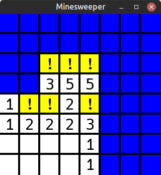
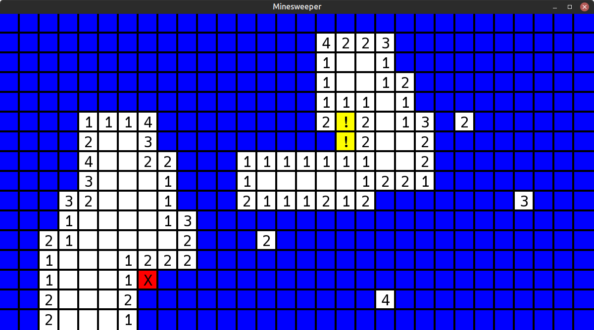

# Minesweeper

## [Screenshots]





## [Description]

An implementation of the classic minesweeper video game.

You can choose from three different levels: easy, medium, and hard. Specify the level you want as the first argument to the program.
If you don't specify a level, or if the level is unrecognized then a message is printed and a default level is used.

The board keeps track of whether the first move has been made, and populates the board with mines after this point.
This is to ensure that no mine lives at the first spot chosen by the player, so the first move of the player can never lose the game.

Left mouse clicks reveal the cell, and right mouse clicks flag it. You cannot reveal a flagged cell, you must unflag it first.

The game ends when you select a mine, or select all non-mine cells.
A message will be printed to the terminal indicating whether or not you won.

## [Resources]

* [Wikiepedia](https://en.wikipedia.org/wiki/Minesweeper_(video_game))

## [How to Compile and Run]

* This program uses the SFML library, so as long as that is installed it can be compiled.

The usual compile command will work, as defined in the Makefile as well,

```bash
g++ -std=c++17 -g ./src/*.cpp -o prog -I./include -lsfml-graphics -lsfml-window -lsfml-system
```

## [Design]

I used various objects,

### `GameConfig`

Stores information derived from the `GameLevel` enum.

Contains the number of:

* Columns
* Rows
* Mines

in the current game.
Also, has a reference to the selected font for drawing text on the cells.

#### Utilities

Additionally, in the `GameConfig` class, there are a bunch of utility functions.
Such as calculating the total window height and width, for the initial window creation; converting a window-relative coordinate to a board index (for interpreting mouse clicks); checking whether or not an xy-position exists (for checking if neighbors exist).

### `Node`

Encapsulates the entirety of a single cell's information.
Any and all metadata related to the cell is stored in `NodeState`.
It's position within the board and all graphical elements are cached as well.

Thus each node is initialized properly and then only updated when it's selected or flagged.
The internal graphical elements can then just be redrawn every frame.

### `Board`

The board stores a collection of nodes, and global game metadata.
The number of un-mined cells remaining that must be revealed before winning, and whether a mine has been selected determine whether the game is running.
The board also keeps track of whether the player has made their first move yet and doesn't place mines until this occurs.
This means the player's first move cannot select a mine.

The board class acts as the external API, with means for drawing the entire board, reacting to reveal or flag commands, and checking whether the game is over yet.

## [Technical Challenge]

First, I created a simple argument parser.
I knew I only needed to select a difficulty level before starting anything, so that was the only cli argument.
Initially, I kept forgetting to put any arg when testing, so I just made the default functionality.
Little by little this class grew to contain more utility functions but otherwise remained the same.

Next, I designed the `NodeState` structure, to simply hold information about a cell.
I got this information from wikipedia; each cell needs to know whether it's a mine, whether it's flagged or revealed or unrevealed, and if it's not a mine then the number of mines adjacent to this cell.
A default constructor worked perfectly to initialize this struct.

The board was much more challenging to implement.
I was aware that I would need to ensure the user couldn't lose on the first move.
I figured adding the functionality to remove a mine and decrement its neighbors would be cumbersome, so I just delayed creating the mines until the player made their first move.

The majority of the game functionality is within the `selectCell` function.
If a mine is selected then the game is over.
If an empty cell is selected then all its neighbors are recursively revealed.
Otherwise, the text on the cell is updated and displayed.

Terminating the game was tricky.
I ended up calculating how many cells the user needs to select before all that's left are mines.
Then, this counter is decremented for every non-mine selection.
I wasn't sure how to graphically indicate a gameover, so the result is just printed to standard output.
The alternative would've been to close the window on the user, but I didn't want a mine-selection to just kill the window.

## [Results]

The game works and doesn't crash!
I didn't follow a tutorial so it was kind of hard to build but I got the hang of creating each stage sort of.
First, just getting the board to display.
Then, accepting user input.
Then, hiding the mines and updating the neighbor counts.
And finally, running the entire game.

## [Additional Notes]

Very fun!

